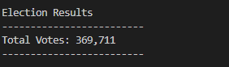

# Election_Analysis

## **Overview of Project**

### To fulfill the request for additional data regarding the voter turnout for each county, the percentage of votes from each county out of the total count, and the county with the highest turnout in order to complete the audit.

## **Election-Audit Results**

- **How many votes were cast in this congressional election?**

  - _There were 369,711 votes cast in this congressional election._
  
    

- **Provide a breakdown of the number of votes and the percentage of total votes for each county in the precinct.**

  - _The number of votes for each county:_
  
    - _Jefferson County had 38,855 votes._
    
    - _Denver County had 306,055 votes._
    
    - _Apapahoe County had 24,801 votes._
    
  - _The percentage of total votes for each county:_
  
    - _Jefferson County contained 10.5% of the total votes in the precinct._
  
    - _Denver County contained 82.8% of the total votes in the precinct._
  
    - _Apapahoe County contained 6.7% of the total votes in the precinct._
  
    

- **Which county had the largest number of votes?**

  - _Denvor County had the largest number of votes._

    

- **Provide a breakdown of the number of votes and the percentage of the total votes each candidate received.**

  - _The number of votes each candidate received:_
  
    - _Charles Casper Stockham received 85,213 votes._
    
    - _Diana DeGette received 272,892 votes._
    
    - _Raymon Anthony Doane received 11,606 votes.
    
  - _The percentage of the total votes each candidate received:_
  
    - _Charles Casper Stockham received 23.0% of the total votes._
  
    - _Diana DeGette received 73.8% of the total votes._
  
    - _Raymon Anthony Doane received 3.1% of the total votes._

    
  
- **Which candidate won the election, what was their vote count, and what was their percentage of the total votes?**

  - _Diana Degette won the election with 272,892 votes; it was 73.8% of the total votes._
  
    

## **Election-Audit Summary**

- **This python script can be vastly used for any elections with minor modifications required.**

  * Example 1 - Gubernatorial Election:

    * To implement this script for the Gubernatorial Election, we can introduce a dictionary and a list for each state, like the candidate_votes and candidate_options, to hold the candidate names and the respective vote counts. By looping through the data set, we can calculate the total votes and the votes received by each candidate in each state. This information lets us quickly determine the state's winning candidate with respective winning counts and percentages. Finally, we can store the state winners' information in a dictionary, with the names of states as the keys and the state winners as the corresponding values, to display the final election result.  

  * Example 2 - College Student Concil Election:

    * To implement this script for the college student council election, we can initialize a dictionary and a list to hold the candidate names and respective vote counts. By looping through the data set, we can calculate the total votes and the votes received by each candidate to help determine the final winner. Assuming the college years of voters (freshman, sophomore, junior, or senior) are provided, we can also calculate the vote count of each college year for each candidate while looping through the data. This gives us an insight into each candidate's popularity in each college year. A similar study can be conducted for candidates' proposals. Assuming all the candidates need to provide a few proposals for their campaign and the voters are asked to select their favorite proposal when they vote, we can calculate the vote count for each proposal per candidate. With the abovementioned studies, we can provide a complete election result with the winner's popularity and the most favorite proposal from the voters. 

