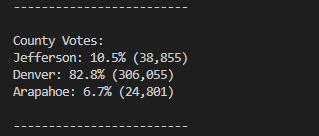

# Election_Analysis

## **Overview of Project**

### To fulfill the request for additional data regarding the voter turnout for each county, the percentage of votes from each county out of the total count, and the county with the highest turnout in order to complete the audit.

## **Election-Audit Results**

- **How many votes were cast in this congressional election?**

  - _There were 369,711 votes cast in this congressional election._
  
    

- **Provide a breakdown of the number of votes and the percentage of total votes for each county in the precinct.**

  - _Jefferson County had 38,855 votes. It was 10.5% of the total votes in the precinct._
  
  - _Denver County had 306,055 votes. It was 82.8% of the total votes in the precinct._
  
  - _Apapahoe County had 24,801 votes. It was 6.7% of the total votes in the precinct._
  
    

- **Which county had the largest number of votes?**

  - _Denvor County had the largest number of votes._

    

- **Provide a breakdown of the number of votes and the percentage of the total votes each candidate received.**

  - _Charles Casper Stockham received 85,213 votes. It was 23.0% of the total votes._
  
  - _Diana DeGette received 272,892 votes. It was 73.8% of the total votes._
  
  - _Raymon Anthony Doane received 11,606 votes. It was 3.1% of the total votes._

    
  
- **Which candidate won the election, what was their vote count, and what was their percentage of the total votes?**

  - _Diana Degette won the election with 272,892 votes; it was 73.8% of the total votes._
  
    

## **Election-Audit Summary**

- **This python script can be vastly used for any elections with minor modifications required.**

  * Example 1 - Gubernatorial Election:

    * To implement this script for the Gubernatorial Election, we can introduce a dictionary and a list for each state, like the candidate_votes and candidate_options, to hold the candidate names and the respective vote counts. By looping through the data set, we can calculate the total votes and the votes received by each candidate in each state. This information lets us quickly determine the state's winning candidate with respective winning counts and percentages. Finally, we can store the state winners' information in a dictionary, with the names of states as the keys and the state winners as the corresponding values, to display the election result.  

  * Example 2 - College Student Concil Election:

    * To implement this script for the college student concil election, we initilize a dictionary and a list to hold the candidate names and respective vote counts. Assuming the Years In College is provided for the candidate

